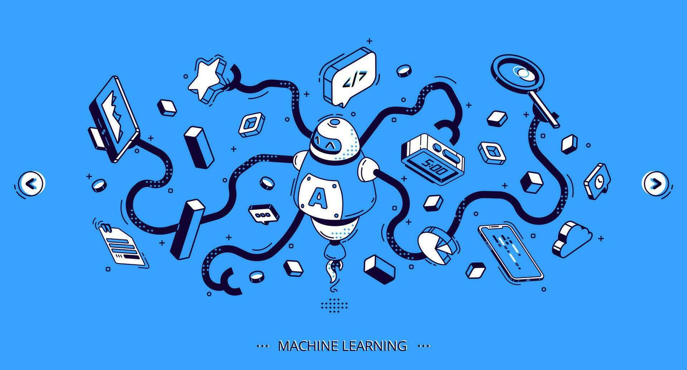

<!-- Banner -->

  

<h1 align="center">Hi, I'm Rodrigo 👋</h1>

  AI student · Web & Mobile Developer · E-commerce · ML/DS

  
  
  
  

---

## 🚀 About me
- I love building **end-to-end systems**: from backend and data to the UI.
- Strong interest in **e-commerce** (MedusaJS/Sanity) and **chatbots** (real projects).
- In ML I focus on **clustering**, **SOMs**, **reinforcement learning**, and Python/Jupyter pipelines.
- Currently learning **Rust** and going deeper into **infra & automation**.

---

## 🧰 Tech Stack (with icons)

### Languages

  
  
  
  
  
  
  
  
  

### Frontend

  
  
  
  

### Backend & CMS

  
  
  
  
  
  
  <img src="https://raw.githubusercontent.com/devicons/devicon/mas
